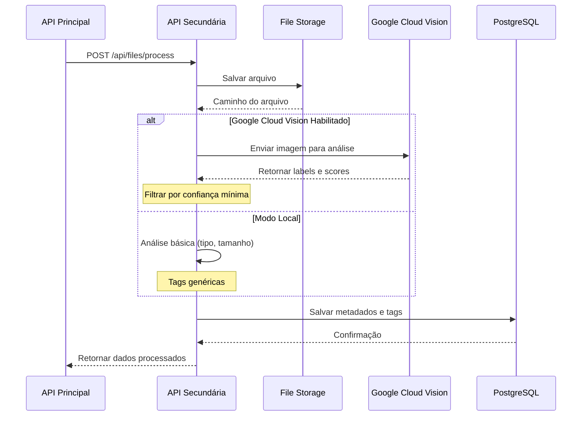

# 🤖 API Secundária - Processamento Inteligente de Arquivos

API especializada desenvolvida em **Flask** para processamento avançado de arquivos utilizando **Google Cloud Vision API** para análise inteligente de imagens e extração automática de tags.

---

## 📋 Índice

- [Visão Geral](#-visão-geral)
- [Google Cloud Vision Integration](#-google-cloud-vision-integration)
- [Tecnologias Utilizadas](#-tecnologias-utilizadas)
- [Estrutura do Projeto](#-estrutura-do-projeto)
- [Configuração e Instalação](#-configuração-e-instalação)
- [Endpoints da API](#-endpoints-da-api)
- [Processamento de Arquivos](#-processamento-de-arquivos)
- [Banco de Dados](#-banco-de-dados)

---

## 🎯 Visão Geral

A **API Secundária** é responsável pelo processamento inteligente de arquivos, oferecendo:

- 🖼️ **Análise de Imagens**: Detecção automática de objetos, cenas e conceitos
- 🏷️ **Extração de Tags**: Geração automática de tags relevantes usando IA
- 📄 **Suporte Multi-formato**: Imagens (JPG, PNG, GIF) e PDFs
- 🔍 **Busca Semântica**: Pesquisa de arquivos por tags e conteúdo
- 💾 **Armazenamento Seguro**: Gerenciamento de uploads em volume Docker

---

## 🌟 Google Cloud Vision Integration

### O que é o Google Cloud Vision?

O **Google Cloud Vision API** é um serviço de machine learning que permite extrair informações de imagens usando modelos de IA pré-treinados. Ele pode:

- Detectar objetos e rostos
- Identificar landmarks e logos
- Reconhecer texto (OCR)
- Classificar conteúdo
- Detectar cores dominantes
- Identificar conteúdo inapropriado

### Como Funciona na Aplicação



### Configuração do Google Cloud Vision

#### 1. Criar Projeto no Google Cloud

1. Acesse [Google Cloud Console](https://console.cloud.google.com/)
2. Crie um novo projeto ou selecione um existente
3. Ative a **Cloud Vision API**:
   - Navegue para "APIs & Services" → "Library"
   - Busque por "Cloud Vision API"
   - Clique em "Enable"

#### 2. Criar Service Account

1. Vá para "IAM & Admin" → "Service Accounts"
2. Clique em "Create Service Account"
3. Preencha:
   - **Name**: `freela-facility-vision`
   - **Role**: `Cloud Vision AI Service Agent`
4. Clique em "Create Key" → Formato JSON
5. Baixe o arquivo `google-credentials.json`

#### 3. Configurar na Aplicação

Coloque o arquivo `google-credentials.json` na raiz do projeto:
```
api-secundaria-mvp/google-credentials.json
```

Configure as variáveis de ambiente no `.env`:

```env
# Google Cloud Vision
GOOGLE_CLOUD_VISION_ENABLED=true
GOOGLE_APPLICATION_CREDENTIALS=/app/google-credentials.json
MIN_TAG_CONFIDENCE=0.7
MAX_TAGS_PER_FILE=15
```

### Exemplo de Resposta do Vision API

**Input**: Imagem de um gato em um sofá

**Output**:
```json
{
  "labels": [
    {"description": "Cat", "score": 0.98},
    {"description": "Furniture", "score": 0.95},
    {"description": "Sofa", "score": 0.92},
    {"description": "Pet", "score": 0.89},
    {"description": "Indoor", "score": 0.85}
  ]
}
```

**Tags Processadas** (com `MIN_TAG_CONFIDENCE=0.7`):
```json
["cat", "furniture", "sofa", "pet", "indoor"]
```

### Modo Fallback (Sem Google Cloud Vision)

Se o Google Cloud Vision não estiver configurado, a API funciona em **modo local**:

- ✅ Análise básica de metadados (tipo, tamanho, dimensões)
- ✅ Tags genéricas baseadas no tipo de arquivo
- ✅ Processamento de PDFs (extração de texto básica)
- ⚠️ Sem análise inteligente de conteúdo visual

---

## 🛠️ Tecnologias Utilizadas

| Tecnologia | Versão | Finalidade |
|------------|--------|------------|
| **Flask** | 3.0.0 | Framework web leve e flexível |
| **Flask-SQLAlchemy** | 3.1.1 | ORM para PostgreSQL |
| **Google Cloud Vision** | 3.5.0 | Análise inteligente de imagens |
| **Pillow** | 10.2.0 | Processamento de imagens |
| **PyPDF2** | 3.0.1 | Extração de texto de PDFs |
| **python-magic** | 0.4.27 | Detecção de tipo MIME |
| **PostgreSQL** | 15-alpine | Banco de dados |

---

## 📁 Estrutura do Projeto

```
api-secundaria-mvp/
├── app/
│   ├── __init__.py
│   ├── main.py                    # Aplicação Flask principal
│   ├── config.py                  # Configurações
│   ├── google-credentials.json    # Credenciais Google Cloud (não versionar!)
│   ├── database/
│   │   └── db.py                 # Conexão PostgreSQL
│   ├── routes/
│   │   └── files.py              # Endpoints de arquivos
│   ├── services/
│   │   ├── file_processor.py     # Lógica de processamento
│   │   └── vision_service.py     # Integração Google Vision
│   └── utils/
│       ├── file_validator.py     # Validação de arquivos
│       └── tag_processor.py      # Processamento de tags
├── uploads/                       # Armazenamento local de arquivos
├── Dockerfile
├── requirements.txt
└── .env
```

---

## ⚙️ Configuração e Instalação

### Variáveis de Ambiente

Arquivo `.env`:

```env
# Flask
FLASK_ENV=development
SECRET_KEY=your-secret-key

# Database
DATABASE_URL=postgresql://postgres:postgres@db:5432/freela_facility_secondary

# Google Cloud Vision
GOOGLE_CLOUD_VISION_ENABLED=true
GOOGLE_APPLICATION_CREDENTIALS=/app/google-credentials.json
MIN_TAG_CONFIDENCE=0.7
MAX_TAGS_PER_FILE=15

# File Upload
MAX_FILE_SIZE=10485760  # 10MB em bytes
ALLOWED_EXTENSIONS=jpg,jpeg,png,gif,pdf
UPLOAD_FOLDER=/app/uploads
```

### Executar com Docker

```bash
# A API Secundária é iniciada automaticamente pelo docker-compose da API Principal
cd api-principal-mvp
docker-compose up --build
```

### Executar Localmente

```bash
cd api-secundaria-mvp

# Criar ambiente virtual
python -m venv venv
source venv/bin/activate  # Linux/Mac
# ou
venv\Scripts\activate     # Windows

# Instalar dependências
pip install -r requirements.txt

# Executar servidor
python -m app.main
```

Acesse: http://localhost:5000

---

## 🔌 Endpoints da API

### Informações da API

| Método | Endpoint | Descrição |
|--------|----------|-----------|
| `GET` | `/` | Informações da API e lista de endpoints |
| `GET` | `/api/files/health` | Health check e status do Google Vision |

### Processamento de Arquivos

| Método | Endpoint | Descrição |
|--------|----------|-----------|
| `POST` | `/api/files/process` | Processar e analisar arquivo |
| `GET` | `/api/files/{id}` | Obter metadados do arquivo |
| `GET` | `/api/files/{id}/tags` | Obter tags do arquivo |
| `PUT` | `/api/files/{id}/tags` | Atualizar tags manualmente |
| `DELETE` | `/api/files/{id}` | Deletar arquivo |

### Busca e Listagem

| Método | Endpoint | Descrição |
|--------|----------|-----------|
| `GET` | `/api/files` | Listar todos os arquivos |
| `POST` | `/api/files/search` | Buscar arquivos por tags |
| `GET` | `/api/files/statistics` | Estatísticas de processamento |

### Exemplo: Processar Arquivo

**Request:**
```bash
curl -X POST http://localhost:5000/api/files/process \
  -F "file=@image.jpg" \
  -F "project_id=123e4567-e89b-12d3-a456-426614174000"
```

**Response:**
```json
{
  "id": "987fcdeb-51a2-43f1-b456-789012345678",
  "filename": "image.jpg",
  "file_type": "image/jpeg",
  "file_size": 245678,
  "project_id": "123e4567-e89b-12d3-a456-426614174000",
  "tags": [
    {"tag": "landscape", "confidence": 0.95, "source": "google_vision"},
    {"tag": "mountain", "confidence": 0.92, "source": "google_vision"},
    {"tag": "nature", "confidence": 0.88, "source": "google_vision"},
    {"tag": "sky", "confidence": 0.85, "source": "google_vision"}
  ],
  "processed_at": "2025-12-12T15:30:00Z",
  "vision_enabled": true
}
```

### Exemplo: Buscar por Tags

**Request:**
```bash
curl -X POST http://localhost:5000/api/files/search \
  -H "Content-Type: application/json" \
  -d '{"tags": ["landscape", "nature"], "min_confidence": 0.8}'
```

**Response:**
```json
{
  "results": [
    {
      "file_id": "987fcdeb-51a2-43f1-b456-789012345678",
      "filename": "image.jpg",
      "matching_tags": ["landscape", "nature"],
      "relevance_score": 0.93
    }
  ],
  "total": 1
}
```

---

## 📊 Processamento de Arquivos

### Fluxo de Processamento

1. **Validação**
   - Verificar tipo de arquivo permitido
   - Validar tamanho máximo
   - Detectar tipo MIME real

2. **Armazenamento**
   - Gerar nome único (UUID)
   - Salvar em volume Docker
   - Registrar caminho no banco

3. **Análise (Google Vision)**
   - Enviar imagem para API
   - Receber labels com scores
   - Filtrar por confiança mínima

4. **Extração de Tags**
   - Processar labels do Vision
   - Adicionar tags customizadas
   - Limitar quantidade máxima

5. **Persistência**
   - Salvar metadados
   - Armazenar tags com scores
   - Retornar resultado

### Tipos de Arquivo Suportados

| Tipo | Extensões | Análise Vision | Processamento Especial |
|------|-----------|----------------|------------------------|
| **Imagem** | `.jpg`, `.jpeg`, `.png`, `.gif` | ✅ Sim | Extração de dimensões |
| **PDF** | `.pdf` | ❌ Não | Extração de texto (PyPDF2) |

---

## 🗄️ Banco de Dados

### Schema: `freela_facility_secondary`

#### Tabela: `processed_files`
```sql
- id: UUID (PK)
- filename: VARCHAR(255)
- file_path: VARCHAR(500)
- file_type: VARCHAR(100)
- file_size: BIGINT
- project_id: UUID (referência externa)
- vision_enabled: BOOLEAN
- processed_at: TIMESTAMP
- created_at: TIMESTAMP
```

#### Tabela: `file_tags`
```sql
- id: SERIAL (PK)
- file_id: UUID (FK → processed_files.id)
- tag: VARCHAR(100)
- confidence: FLOAT
- source: VARCHAR(50)  -- 'google_vision' ou 'manual'
- created_at: TIMESTAMP
```

---

## 🔒 Segurança

> [!CAUTION]
> **Nunca versione o arquivo `google-credentials.json`!**
> 
> Adicione ao `.gitignore`:
> ```
> google-credentials.json
> *.json
> !package.json
> ```

> [!WARNING]
> - Limite o tamanho máximo de upload (`MAX_FILE_SIZE`)
> - Valide tipos de arquivo permitidos
> - Use volumes Docker para isolar arquivos

---

## 📈 Monitoramento

### Health Check

```bash
curl http://localhost:5000/api/files/health
```

**Response:**
```json
{
  "status": "healthy",
  "google_vision_enabled": true,
  "google_vision_configured": true,
  "upload_directory": "/app/uploads",
  "max_file_size_mb": 10
}
```

### Estatísticas

```bash
curl http://localhost:5000/api/files/statistics
```

**Response:**
```json
{
  "total_files": 150,
  "total_size_mb": 1250.5,
  "files_with_vision": 120,
  "total_tags": 1800,
  "avg_tags_per_file": 12,
  "most_common_tags": [
    {"tag": "document", "count": 45},
    {"tag": "landscape", "count": 32},
    {"tag": "person", "count": 28}
  ]
}
```

---

## 🧪 Testes

### Testar Upload

```bash
# Com imagem
curl -X POST http://localhost:5000/api/files/process \
  -F "file=@test_image.jpg" \
  -F "project_id=test-project-123"

# Com PDF
curl -X POST http://localhost:5000/api/files/process \
  -F "file=@document.pdf" \
  -F "project_id=test-project-123"
```

---

## 💡 Dicas de Uso

> [!TIP]
> **Otimize a confiança mínima**: Ajuste `MIN_TAG_CONFIDENCE` baseado na qualidade das suas imagens:
> - `0.9+`: Apenas tags muito confiáveis (menos tags, mais precisas)
> - `0.7-0.8`: Balanceado (recomendado)
> - `0.5-0.6`: Mais tags, menos precisas

> [!TIP]
> **Custos do Google Vision**: O Vision API tem [pricing por requisição](https://cloud.google.com/vision/pricing):
> - Primeiras 1.000 unidades/mês: GRÁTIS
> - 1.001 - 5.000.000: $1.50 por 1.000 unidades
> - Use o modo local para desenvolvimento/testes

---

## 🔗 Links Relacionados

- [← Voltar para API Principal](../../api-principal-mvp/README.md)
- [Google Cloud Vision Documentation](https://cloud.google.com/vision/docs)
- [Frontend - Guia do Usuário](../../frontend-mvp/README.md)

---

## 📄 Licença

Este projeto é parte do MVP Freela Facility.
